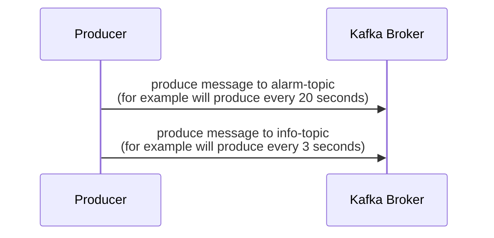
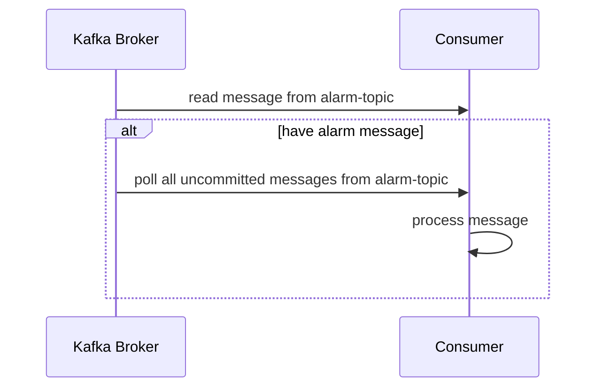

# Kafka Client Golang Event-based POC
Kafka client for event-based concept. This example, will have 2 topics, one is **alarm-topic** is use for *trigger event*, another is **info-topic** is use as the *queue* of messages. 

If consumer received the message from *alarm-topic* will poll all messages from *info-topic* to do something after.

## Sequence Diagram

### Producer

### Consumer
