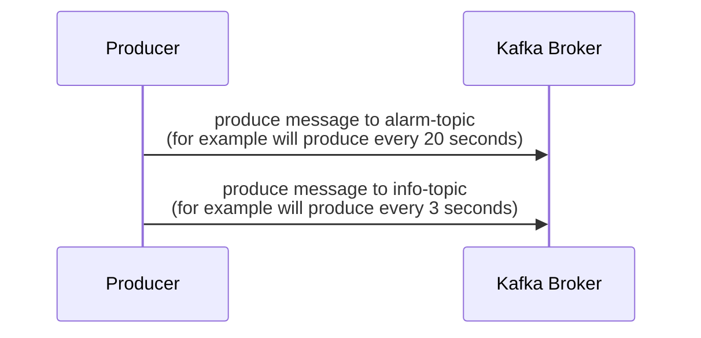
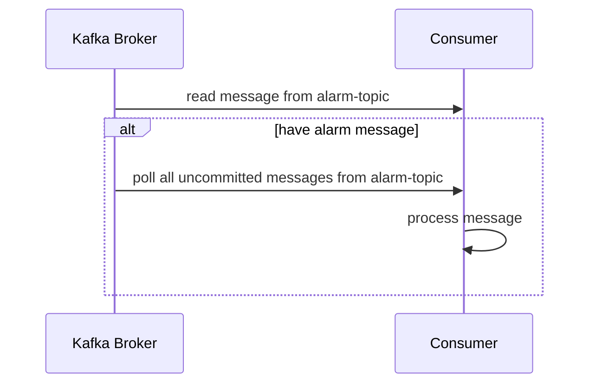

# Kafka Client Golang Event-based POC
Kafka client for event-based concept. This example, will have 2 topics, one is **alarm-topic** is use for *trigger event*, another is **info-topic** is use as the *queue* of messages. 

If consumer received the message from *alarm-topic* will poll all messages from *info-topic* to do something after.

## Sequence Diagram

### Producer


### Consumer


## Tips

### Kafka Security

If your broker is required to use key file to connect. Add the security config like this example.

```Go
producer, err := kafka.NewProducer(&kafka.ConfigMap{
    "bootstrap.servers": bootstrapServers,
    "security.protocol": "SSL",
    "ssl.ca.location":   "path/to/key.pem",
  })
```

### Handling poll and have no message

Use the config ` "enable.partition.eof": true` and break the loop after found the end of partition like this example.

```Go
consumer, err := kafka.NewConsumer(&kafka.ConfigMap{
  "bootstrap.servers": bootstrapServers,
  "group.id":          groupId,
  "auto.offset.reset": "earliest",
})

...

run := true
for run {
  ev := consumer.Poll(100)
  switch e := ev.(type) {
  case *kafka.Message:
    fmt.Printf("Message: %v\n", e)
  case kafka.PartitionEOF:
    fmt.Printf("PartitionEOF: %v\n", e)
    run = false
  case kafka.Error:
    fmt.Printf("Error: %v\n", e)
  default:
    fmt.Printf("Ignored %v\n", e)
  }
}
```

## Read only n last message

```Go
message.TopicPartition.Offset = kafka.OffsetTail(1)
```

## Disable auto commit to commit only processed message

Use the config `"enable.auto.commit": false` and commit message after processed.

```Go
consumer, err := kafka.NewConsumer(&kafka.ConfigMap{
  "bootstrap.servers":    bootstrapServer,
  "group.id":             infoGroupId,
  "auto.offset.reset":    "earliest",
  "enable.auto.commit":   false,
  "enable.partition.eof": true,
})

run := true
consumer.Subscribe(infoTopic, nil)

for run {
  infoEvent := consumer.Poll(100)
  switch message := infoEvent.(type) {
  case *kafka.Message:
    if message.Timestamp.After(endTime) {
      run = false
      break
    }

    processMessage(message)
    _, err := consumer.CommitMessage(message)
    if err != nil {
      fmt.Println(err)
      run = false
      break
    }
  case kafka.PartitionEOF:
    fmt.Printf("PartitionEOF: %v\n", message)
    run = false
  case kafka.OffsetsCommitted:
    fmt.Printf("OffsetsCommitted: %v\n", message)
  case kafka.Error:
    fmt.Printf("Error: %v\n", message)
  default:
    fmt.Printf("Ignored %v\n", message)
  }
}
consumer.Unsubscribe()
```

### More configurations

[edenhill/librdkafka](https://github.com/edenhill/librdkafka/blob/master/CONFIGURATION.md)

## References

- [confluentinc/confluent-kafka-go](https://github.com/confluentinc/confluent-kafka-go)
- [Kafka Go Client](https://docs.confluent.io/kafka-clients/go/current/overview.html)
- [Kafka Go Consumer (Function-based)](https://rmoff.net/2020/07/14/learning-golang-some-rough-notes-s02e04-kafka-go-consumer-function-based/)
- [Setting offsets #60 - confluentinc/confluent-kafka-go](https://github.com/confluentinc/confluent-kafka-go/issues/60)

Security
- [Encrypt and Authenticate with TLS](https://docs.confluent.io/platform/current/kafka/authentication_ssl.html#encrypt-and-authenticate-with-tls)
- [Go: Code Example for Apache Kafka®](https://docs.confluent.io/platform/current/tutorials/examples/clients/docs/go.html#basic-producer-and-consumer)
- [Using TLS certificate for kafka #568](https://github.com/confluentinc/confluent-kafka-go/issues/568)
- [Using TLS Authentication for your Go Kafka Client](https://www.process-one.net/blog/using-tls-authentication-for-your-go-kafka-client/)

Docker issues
- [1.4.0: Building apps fails on latest alpine, when using bundled librdkafka #454 - confluentinc/confluent-kafka-go](https://github.com/confluentinc/confluent-kafka-go/issues/454)
- [Forcing docker to use linux/amd64 platform by default on macOS](https://stackoverflow.com/questions/65612411/forcing-docker-to-use-linux-amd64-platform-by-default-on-macos)